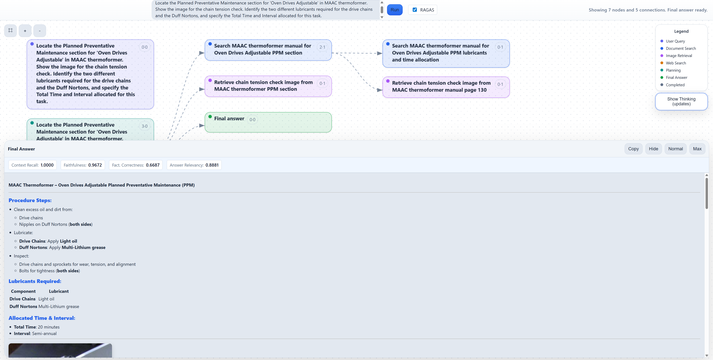

# MDF Agentic Manufacturing Assistant

RAG pipeline with a multi-step reasoning agent for manufacturing equipment documentation. Renders the agent's logic as an interactive DAG in a web UI.



---

## Prerequisites

Install these **before** running the install script:

1. **Python 3.11+** - [python.org/downloads](https://www.python.org/downloads/) (check "Add to PATH")
2. **Ollama** - [ollama.com/download](https://ollama.com/download)
3. **Node.js 18+** - [nodejs.org](https://nodejs.org/) (LTS recommended)

---

## Ollama Models (Pull Manually)

Make sure Ollama is running (`ollama serve`), then pull these models:

```bash
# Main reasoning LLM
ollama pull hf.co/bartowski/mistralai_Ministral-3-8B-Instruct-2512-GGUF:Q4_K_M

# Embedding model
ollama pull hf.co/ChristianAzinn/mxbai-embed-large-v1-gguf:Q4_K_M

# RAGAS judge model
ollama pull hf.co/bartowski/Meta-Llama-3.1-8B-Instruct-GGUF:Q4_K_M

# VLM image
ollama pull hf.co/cjpais/llava-1.6-mistral-7b-gguf:Q4_K_M

# The vlm-yolo-detector also uses sentence-transformers/all-MiniLM-L6-v2 for image embeddings,
# but that's a Python package model downloaded via HuggingFace (not an Ollama model),and it gets
# cached locally during install.bat in the .cache/ directory.
```

---

## Local Installation

```bash
# 1. Clone
git clone https://github.com/Manufacturing-Demonstration-Facility/agentic-rag.git
cd agentic-rag

# 2. Run install script (select mode 0 for Online)
install.bat

# 3. Start
start.bat
```

- **UI**: http://localhost:3000
- **API**: http://localhost:8000

---

## Docker Installation

For teams that want a consistent environment without managing Python/Node locally.

### Prerequisites

- Docker Desktop installed and running
- Ollama running on the **host** machine (not inside Docker)
- Ollama models pulled (see above)
- `vlm-yolo-detector` cloned alongside this repo (for image search)

### Steps

```bash
# 1. Clone both repos side-by-side
git clone https://github.com/Manufacturing-Demonstration-Facility/agentic-rag.git
git clone https://github.com/morkev/vlm-yolo-detector.git

# 2. Enter the project
cd agentic-rag

# 3. Create docker env file
copy .env.docker.example .env.docker

# 4. Start containers
docker-start.bat
```

- **UI**: http://localhost:3000
- **API**: http://localhost:8000

### Docker Troubleshooting: SSL Certificate Error

If Docker build fails with `SSL: CERTIFICATE_VERIFY_FAILED` (common on corporate networks with SSL inspection):

The Dockerfile already includes `--trusted-host` flags. If it still fails, inject your corporate CA certificate:

```dockerfile
# Add to Dockerfile.backend before the pip install line:
COPY your-corporate-ca.crt /usr/local/share/ca-certificates/
RUN update-ca-certificates
```

---

## Image Search Setup (Optional)

For image retrieval from equipment manuals, set up the companion repo:

```bash
cd ..
git clone https://github.com/morkev/vlm-yolo-detector.git
cd vlm-yolo-detector
install.bat
```

Expected layout:
```
Repositories/
+-- agentic-rag/
+-- vlm-yolo-detector/
```

---

## Configuration

Edit `.env` to change models or behavior:

| Variable | Default | Purpose |
|----------|---------|---------|
| `OLLAMA_MODEL` | Ministral-3-8B-Instruct-2512 | LLM for reasoning |
| `OLLAMA_EMBED_MODEL` | mxbai-embed-large-v1-gguf | Embedding model |
| `OFFLINE_MODE` | true | Disable web tools |
| `RAGAS_JUDGE_MODEL` | Meta-Llama-3.1-8B-Instruct | Benchmark judge |

---

## Architecture

- **Backend**: FastAPI (port 8000) - agent orchestration, RAG, tool execution
- **Frontend**: JavaScript (port 3000) - interactive reasoning tree visualization
- **Ollama**: Local LLM inference (port 11434)
- **vlm-yolo-detector**: Offline image pipeline (sibling repo)
